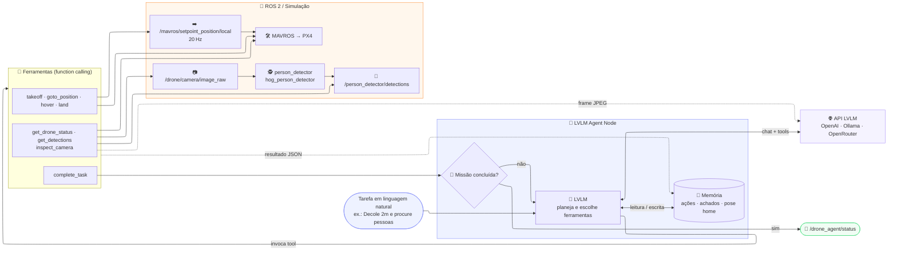

# Arquitetura Oracle Vision

## Scripts de entrada

| Script | Função |
|--------|--------|
| `iniciar_drone.sh` | Isaac Sim + Pegasus + PX4 |
| `run_mavros_px4.sh` | Ponte ROS ↔ PX4 |
| `run_person_detector.sh` | Detecção de pessoas (HOG) |
| `run_lvlm_agent.sh` | Agente LVLM + navegação |
| `voar_drone.sh` | Decolagem OFFBOARD simples |
| `land_drone.sh` | AUTO.LAND |
| `check_mavlink_ports.sh` | Diagnóstico de portas |

> **Nota:** use apenas **um** controlador por vez (`voar_drone`, `lvlm_agent`, `search_and_track` ou `cfc_controller`) — todos publicam setpoints no MAVROS.
