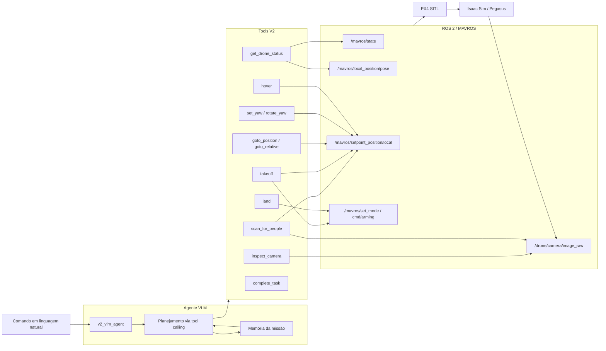

# V2 VLM-Only Architecture

A V2 reconstrói o controle do drone como um pipeline VLM-only. O operador envia texto em linguagem natural, o agente chama um VLM OpenAI-compatible com tool-calling, e todas as ações passam por tools explícitas para MAVROS/PX4/câmera.

Não há fallback heurístico nesta versão. Se a API VLM não estiver configurada, o agente falha ao iniciar com uma mensagem clara.



## Componentes

- `v2_vlm_drone`: pacote ROS 2 novo e isolado.
- `v2_vlm_agent`: nó principal, assina `/v2/task` e publica `/v2/status`.
- `VlmClient`: cliente HTTP OpenAI-compatible para OpenAI, OpenRouter, Ollama ou outro endpoint compatível.
- `V2RosTools`: tools determinísticas para status, câmera, busca de pessoas, decolagem, movimento, yaw, hover, pouso e encerramento.
- `V2Memory`: memória curta da missão com home pose, ações recentes e achados visuais.

## Limites

Os limites são parâmetros ROS do agente:

```bash
min_alt_m=0.5
max_alt_m=10.0
max_radius_m=15.0
```

O agente recusa movimento se MAVROS não estiver conectado. `land` continua permitido como comando de segurança.
